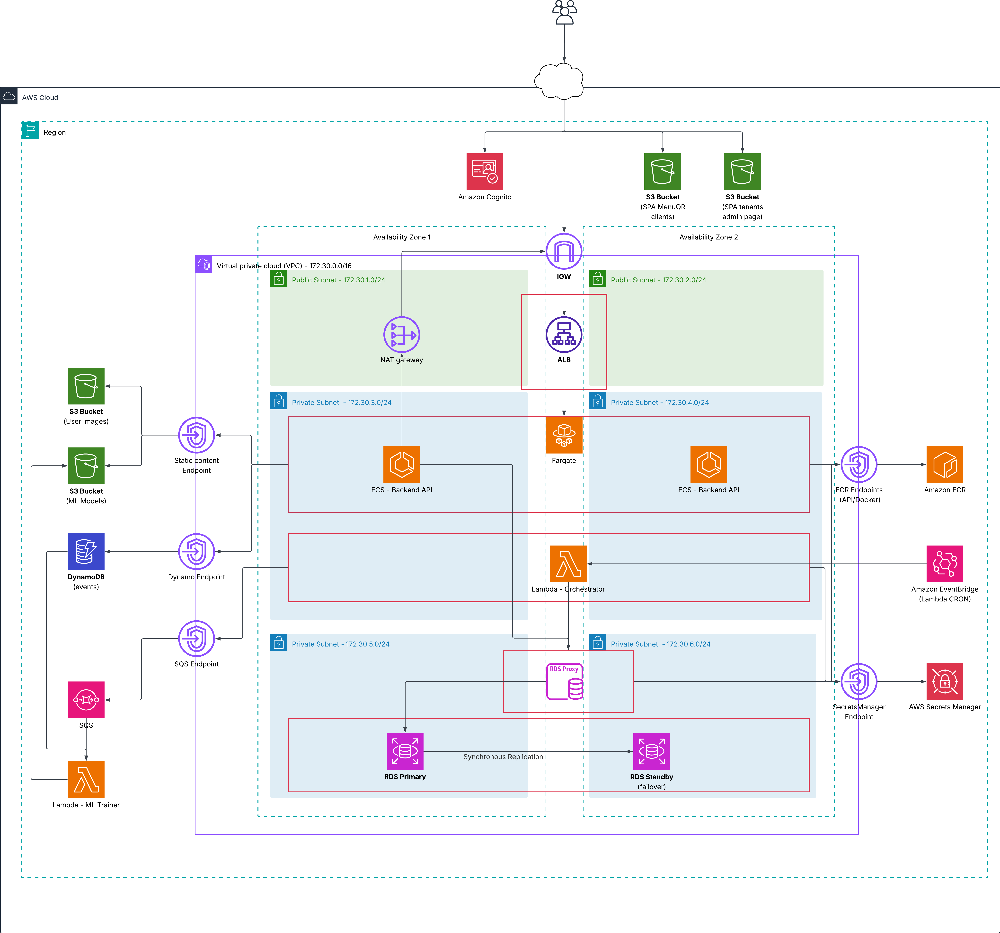

# Cloud Computing - TP3 - Terraform
### Grupo 3 - 2026Q1 - ITBA

## Introducción

MenuQR es una aplicación multi-tenant para el manejo de menus digitales.  
Cada restaurante administra su carta desde un panel web y los clientes acceden al menú mediante un código QR desde su celular,
Además, se recompilan datos de interacción que se usan para analitica y entrenamiento de modelos de recomendaciones personalizados a cada restaurante

## Arquitectura



## Requerimientos

Despliegue en **AWS** desde Linux, macOS o [WSL 2](https://learn.microsoft.com/es-es/windows/wsl/install) en Windows. Los scripts usan `bash`.

### Cuenta y credenciales AWS

| Requisito | Detalle                                                                                          |
|-----------|--------------------------------------------------------------------------------------------------|
| Cuenta AWS | Permisos para VPC, RDS, ECS, Lambda, S3, DynamoDB, ECR, etc.                                     |
| Rol **LabRole** | De **AWS Academy** (`data.aws_iam_role.lab_role` en Terraform)                                   |
| [AWS CLI](https://docs.aws.amazon.com/cli/latest/userguide/getting-started-install.html) v2 | `aws configure` o variables `AWS_ACCESS_KEY_ID`, `AWS_SECRET_ACCESS_KEY` y, si aplica, `AWS_SESSION_TOKEN` |

Para que `terraform plan` corra en GitHub Actions, las mismas credenciales deben cargarse como [secrets del repositorio](#secrets-del-repositorio) (ver sección CI).

```bash
aws sts get-caller-identity
```

[Configurar el AWS CLI](https://docs.aws.amazon.com/es_es/cli/latest/userguide/cli-chap-configure.html).

### Herramientas de despliegue

| Herramienta | Versión | Uso en AWS |
|-------------|---------|------------|
| [Terraform](https://developer.hashicorp.com/terraform/install) | ≥ **1.8.5** | Infraestructura (`terraform apply`) |
| [AWS CLI](https://docs.aws.amazon.com/cli/latest/userguide/getting-started-install.html) | v2 | Deploy, `aws s3 sync`, ECR |
| [Docker](https://docs.docker.com/engine/install/) | Reciente | Backend → ECR; **obligatorio** para Lambdas ML ([nota](#empaquetado-de-lambdas-ml)) |
| [JDK](https://adoptium.net/) + [Maven](https://maven.apache.org/install.html) | Java **21**, Maven 3.9+ | Build Quarkus (`deploy-backend.sh`) |
| [Node.js](https://nodejs.org/) | **20 LTS** + npm | Build SPAs → S3 (`deploy-frontends.sh`) |
| [Python](https://www.python.org/downloads/) + **pip** | **3.12** | Opcional: solo con `LAMBDA_BUILD_NATIVE=1` (sin Docker; no recomendado) |

Providers Terraform: **hashicorp/aws** (≥ 5.71.0), **hashicorp/archive** (≥ 2.0).

### Comandos por script

| Script | Herramientas en `PATH` |
|--------|------------------------|
| `terraform/scripts/deploy.sh` | `terraform`, `aws`, `bash` |
| `terraform/scripts/deploy-backend.sh` | `terraform`, `docker`, `mvn`, `aws` |
| `terraform/scripts/deploy-frontends.sh` | `terraform`, `npm`, `aws` |
| `ml-training/scripts/build_lambda_dists.sh` | `docker`, `bash` |

## Scripts (`terraform/scripts/`)

| Script | Uso                                                             |
|--------|-----------------------------------------------------------------|
| `deploy.sh` | **Completo:** Lambdas → `terraform apply` → backend → frontends |
| `deploy-backend.sh` | Buildea imagen y sube a ECS                                     |
| `deploy-frontends.sh` | Build Vite + sync S3                                            |

El empaquetado de Lambdas ocurre en `ml-training/scripts/build_lambda_dists.sh` (lo invoca `deploy.sh`).

### Empaquetado de Lambdas ML

`build_lambda_dists.sh` **siempre usa Docker** (imagen `public.ecr.aws/sam/build-python3.12`) para generar el zip con `psycopg2` compatible con Lambda. Así el comando es el mismo en Linux, macOS y Windows (WSL):

```bash
bash ml-training/scripts/build_lambda_dists.sh
```

Requisito: **Docker** instalado y en ejecución. Tras un rebuild, volvé a desplegar (`terraform apply` o `deploy.sh`).

Sin Docker (solo desarrollo / CI especial): `LAMBDA_BUILD_NATIVE=1 bash ml-training/scripts/build_lambda_dists.sh` — en macOS ARM puede fallar o romper la Lambda en AWS (`No module named 'psycopg2._psycopg'`).

**GitHub Actions:** los runners traen Docker; el workflow no necesita pasos distintos por SO.

Más detalle: `ml-training/README.md`.

## Instrucciones de Ejecución

### Primera vez: estado remoto (S3 + DynamoDB)

Antes del primer `terraform apply`, crear el bucket y la tabla de locks (solo una vez por cuenta AWS):

```bash
bash terraform/scripts/terraform-init-remote.sh
```

Genera `terraform/backend.hcl` (no se commitea) y deja listo `terraform init` contra S3.

Para CI, copiar `TF_STATE_BUCKET` y `TF_STATE_DYNAMODB_TABLE` a los secrets de GitHub (salida del script, del workflow **Terraform init remote**, o `terraform -chdir=terraform/bootstrap output`).

El script es **idempotente**: si el bucket y la tabla ya existen en la cuenta, omite el `apply` del bootstrap y solo escribe `backend.hcl` + `terraform init`.

### Paso a paso

Iniciando desde la carpeta raiz del repositorio, ejecutar los siguientes comandos

```bash
bash terraform/scripts/terraform-init-remote.sh #Solo si el backend remoto no fue inicializado 
```

```bash
bash ml-training/scripts/build_lambda_dists.sh 
```

```bash
cd ./terraform
```

```bash
terraform apply
```

```bash
bash scripts/deploy-backend.sh
```

```bash
bash scripts/deploy-frontends.sh
```

```bash
terraform output frontend_admin_website_url
terraform output frontend_menu_website_url
```

### Alternativa - Script completo

`deploy.sh` usa `backend.hcl` automáticamente si existe (ejecutar el bootstrap antes la primera vez):

```bash
bash terraform/scripts/terraform-init-remote.sh   # solo la primera vez
bash terraform/scripts/deploy.sh
```

### Outputs útiles

Las URL de las pagínas y API se pueden consultar con 

```bash
terraform output backend_api_url
terraform output frontend_admin_website_url
terraform output frontend_menu_website_url
```

### Justificación del uso de scripts Bash

La subida de imagenes a ECR y de archivos de los sitios web a los S3 se realiza mediante scripts.
Si bien esto tecnicamente podria hacerse mediante terraform, no lo consideramos una buena practica, puesto que Terraform está
orientado al aprovisionamiento y gestión declarativa de infraestructura, no al build ni despliegue de artefactos de aplicación.

Separar estas responsabilidades permite:

- Mantener los terraform apply idempotentes y más predecibles;
- Evitar que cambios frecuentes de código generen cambios innecesarios en la infraestructura;
- Desacoplar el ciclo de vida de la aplicación del de la infraestructura;

Por este motivo, Terraform se utiliza únicamente para crear y configurar la infraestructura necesaria, mientras que los scripts Bash se encargan de:

- Construir y subir imágenes Docker a ECR;
- Empaquetar y desplegar Lambdas;
- Compilar y sincronizar los frontends en los buckets S3 correspondientes;

## Instrucciones de Prueba

### Flujo principal

**Desde la consola de admin** (`frontend_admin_website_url`):

1. **Registrar una cuenta** — Crear un nuevo usuario para el restaurante.
2. **Crear un menú** — Desde el panel de admin, crear un menú para el restaurante.
3. **Agregar una sección** — Dentro del menú, crear al menos una sección (ej: "Entradas", "Platos principales", "Bebidas").
4. **Agregar platos** — Agregar platos a cada sección con nombre, descripción y precio.
5. **Crear una mesa** — En la sección de mesas, agregar una nueva. Al crearla se genera un código QR que apunta a la URL del menú para esa mesa.

**Desde la interfaz de cliente** (copiando la URL o escaneando el QR de la mesa):

6. **Hacer un pedido** — Navegar el menú, agregar platos al carrito y confirmar la orden. Antes de confirmar se muestran recomendaciones personalizadas (o aleatorias si no hay modelo entrenado aún).

7. **Actualizar el estado del pedido** — El administrador puede cambiar el estado del pedido (recibido, en preparación, etc). El cliente por su parte puede pedir la cuenta desde su interfaz
8. **Cerrar el pedido** — Marcar el pedido como cerrado desde la consola de admin. El cobro queda a cargo del negocio por sus propios medios (el sistema no gestiona pagos).

### Modelos de recomendación (ML)

El entrenamiento de modelos es responsabilidad de las Lambdas. Se usa EventBridge para invocar una Lambda orquestadora según un CRON (configurable como variable en Terraform; por defecto, una vez por día).

La Lambda orquestadora obtiene todos los tenants de la RDS y encola un mensaje por tenant en SQS. Una segunda Lambda consume la cola y entrena un modelo de recomendaciones de platos por tenant. Los modelos se guardan en S3 y el backend los usa para dar recomendaciones.

> Si no hay modelo entrenado aún, el backend genera recomendaciones aleatorias. Si el modelo se entrena inmediatamente tras levantar la aplicación, puede no haber datos suficientes para que sea útil, pero el modelo se generará y almacenará correctamente.

Las recomendaciones se muestran en el modal que aparece antes de confirmar la orden.

Para invocar la Lambda orquestadora manualmente (fuera del CRON) y verificar la carga de modelos:

```bash
aws lambda invoke \
  --function-name menuqr-ml-orchestrator \
  --region us-east-1 \
  --payload '{}' \
  --cli-binary-format raw-in-base64-out \
  /tmp/orchestrator-out.json

cat /tmp/orchestrator-out.json
```

Luego, puede verificarse que haya sido creado en el bucket de ML. Si no hay tenants registrados, no se creará ningun modelo.

## Terraform

### Estado remoto (S3 + DynamoDB)

El state de Terraform puede guardarse en **S3** con bloqueo en **DynamoDB** (evita applies concurrentes y permite compartir estado entre máquinas y CI).

| Recurso | Nombre (ejemplo) |
|---------|------------------|
| Bucket S3 | `menuqr-tfstate-<account-id>` |
| Tabla DynamoDB | `menuqr-tf-locks` |
| Clave del state | `menuqr/terraform.tfstate` |

**Primera vez (bootstrap):** el bucket y la tabla se crean en un stack aparte con estado local (`terraform/bootstrap/`), porque el backend remoto aún no existe.

```bash
bash terraform/scripts/terraform-init-remote.sh
```

Eso escribe `terraform/backend.hcl` (gitignored) y ejecuta `terraform init` contra S3. Si ya tenías `terraform.tfstate` local:

```bash
MIGRATE_LOCAL_STATE=1 bash terraform/scripts/terraform-init-remote.sh
```

`deploy.sh` usa `backend.hcl` automáticamente si existe.

**CI:** los mismos valores van a los secrets del repositorio (ver [Secrets del repositorio](#secrets-del-repositorio) y el workflow **Terraform init remote**, que los imprime en el job summary). Ejemplo: `menuqr-tfstate-123456789012`, `menuqr-tf-locks`.

Plantilla: `terraform/backend.hcl.example`.

### CI en GitHub Actions

La región usada en CI es `us-east-1`, igual que en `terraform/provider.tf`.

#### Secrets del repositorio

Configurarlos en **Settings → Secrets and variables → Actions → Repository secrets**

| Secret | Plan / init remoto | Deploy (remoto) | Deploy (local) | Descripción |
|--------|-------------------|-----------------|----------------|-------------|
| `AWS_ACCESS_KEY_ID` | Sí | Sí | Sí | Access key (p. ej. AWS Academy). |
| `AWS_SECRET_ACCESS_KEY` | Sí | Sí | Sí | Secret asociado. |
| `AWS_SESSION_TOKEN` | Sí en Academy | Sí en Academy | Sí en Academy | Token de sesión temporal. |
| `TF_STATE_BUCKET` | No | **Sí** | No | Bucket S3 del estado remoto. |
| `TF_STATE_DYNAMODB_TABLE` | No | **Sí** | No | Tabla DynamoDB de locks. |

**Cómo obtener los valores (AWS Academy):**

1. Iniciar sesión en el [Learner Lab](https://awsacademy.instructure.com/) y abrir **AWS Academy Learner Lab**.
2. Pulsar **Start Lab** y esperar a que el indicador esté en verde.
3. En **AWS Details** → **AWS CLI**, copiar las credenciales que muestra el panel (incluyen `aws_access_key_id`, `aws_secret_access_key` y `aws_session_token`).
4. Pegar cada valor en el secret homónimo del repositorio de GitHub.

Renovar los secrets cuando expire la sesión del lab (suelen caducar tras unas horas); si falla con `ExpiredToken`, actualizar los tres secrets `AWS_*`.

#### Workflows (manual, `workflow_dispatch`)

| Workflow | Archivo | Cuándo usarlo |
|----------|---------|---------------|
| **Terraform init remote** | `.github/workflows/terraform-init-remote.yml` | **Primera vez** por cuenta AWS (o tras reset del lab): crea bucket S3 + tabla DynamoDB, ejecuta `terraform init` contra el backend remoto e imprime los valores para `TF_STATE_*`. Idempotente si los recursos ya existen. |
| **AWS deploy** | `.github/workflows/aws-deploy.yml` | Despliegue completo: Lambdas → `terraform apply` → espera RDS Proxy → backend (ECR/ECS) → frontends (S3). Por defecto usa backend remoto (`use_remote_backend: true`). |
| **Terraform init, validate & plan** | `.github/workflows/terraform_init_validate_plan.yml` | Validación y plan (también en PR/push). `TF_STATE_*` opcionales. |

**AWS deploy — inputs al ejecutar el workflow:**

| Input | Default | Descripción |
|-------|---------|-------------|
| `use_remote_backend` | `true` | Con `true`: `terraform init` contra S3 (secrets `TF_STATE_*` obligatorios). Con `false`: `terraform init -backend=false` (state local en el runner; solo `AWS_*`). |

**Orden recomendado en CI (backend remoto):**

1. Configurar secrets `AWS_*` (Learner Lab) en **Settings → Secrets and variables → Actions → Repository secrets**.
2. Ejecutar **Terraform init remote** → en el **Summary** del job aparece una tabla con `TF_STATE_BUCKET` y `TF_STATE_DYNAMODB_TABLE`; copiarlos a secrets del repo.
3. Ejecutar **AWS deploy** (dejar `use_remote_backend` activado).

**Dónde ver las URLs tras el deploy (Actions):**

Al finalizar **AWS deploy**, el paso *Deployment URLs* escribe en el **Summary** del job:

| Recurso | Origen |
|---------|--------|
| API backend | `backend_api_url` |
| Admin SPA (sitio web) | `frontend_admin_website_url` |
| Menú público (sitio web) | `frontend_menu_website_url` |
| RDS Proxy | `db_proxy_endpoint` |

Son las URLs HTTP del ALB y de los buckets S3 con website hosting (mismos `terraform output` que en la sección **Outputs útiles** más abajo). Los artefactos estáticos viven en los buckets `frontend_admin_s3_bucket` y `frontend_menu_s3_bucket` (visibles en los logs del paso *Deploy frontends*, no en ese summary).

**Deploy sin backend remoto (solo pruebas):**

En **Run workflow**, desactivar `use_remote_backend`. No hace falta `TF_STATE_*`. El state vive solo en el runner del job: **no persiste** entre ejecuciones; un segundo deploy puede chocar con recursos ya creados en AWS o intentar recrearlos. Útil para un lab desechable o una primera prueba rápida; para trabajo habitual usar remoto.

Equivalente local con remoto: `bash terraform/scripts/terraform-init-remote.sh` y luego `bash terraform/scripts/deploy.sh`. Sin remoto: `terraform init -backend=false` en `terraform/` y el mismo `deploy.sh` (si no existe `backend.hcl`).

#### Plan en PR/push (`terraform_init_validate_plan.yml`)

En cada **pull request** o **push** que toque `terraform/` (u otras rutas del workflow), se ejecuta `terraform fmt`, `validate` y, si hay credenciales AWS configuradas, un `terraform plan` contra la cuenta real.

### Módulos propios

| Módulo | Uso                                          |
|--------|----------------------------------------------|
| `modules/python-lambda` | Lambda desde directorio (zip con `archive_file`) |
| `modules/s3-private` | Buckets privados versionados                 |
| `modules/s3-public-website` | SPAs con website hosting                     |

### Módulos externos

| Módulo | Uso |
|--------|-----|
| `terraform-aws-modules/vpc` | VPC, subredes, NAT |
| `terraform-aws-modules/rds-proxy` | RDS Proxy |

### Funciones

| Función | Ejemplo en el repo |
|---------|-------------------|
| `slice` | `locals.tf` — subredes / AZs |
| `cidrsubnets` | `locals.tf` — CIDRs por capa |
| `toset` | `s3.tf`, `vpc_endpoint.tf` — `for_each` |
| `jsonencode` | `ecs.tf` — task definition (contenedor) |
| `coalesce` | `modules/python-lambda` — VPC SG |

### Meta-argumentos

| Meta-argumento | Ejemplo |
|----------------|---------|
| `for_each` | Buckets S3, gateway VPC endpoints |
| `depends_on` | ECS service → ALB listener; políticas S3 |
| `lifecycle` | Security groups (`create_before_destroy`); ECS `ignore_changes` en `desired_count` |
| `dynamic` | Bloque `vpc_config` en módulo Lambda |

